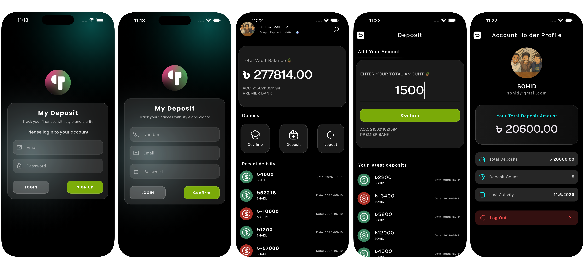

# Deposit Tracker

A real-time financial transparency application built with Flutter and Supabase.

##

  

##

## Overview
This application provides a transparent, real-time ledger for shareholders and account holders. It facilitates collective financial monitoring, allowing users to manage their deposits while giving shareholders a live bird's-eye view of all account activities.

## Key Features

### Shareholder Dashboard
* **Live Activity Stream:** View a real-time "Recent Activity List" showing deposits from all holders as they happen.
* **Aggregate Fund Tracking:** Monitor the total collective balance from the main screen at a glance.

### Account Holder Experience
* **Personal Ledger:** View specific deposit history, including latest entries and a full chronological archive with timestamps.
* **Deposit Management:** Seamlessly add new funds or delete existing entries with immediate synchronization.
* **Contribution Analytics:** The Profile screen provides a summary of individual engagement, calculating the total frequency and aggregate amount contributed.

## System Architecture
The project follows the **MVC (Model-View-Controller)** design pattern:
* **Models:** Data objects for Users and Deposits.
* **Views:** Modular Flutter widgets for the Dashboard and Profile.
* **Controllers:** Logic layers handling Supabase Auth, Real-time subscriptions, and state updates.

## Technical Stack
* **Frontend:** Flutter
* **Backend:** Supabase (PostgreSQL, Real-time, Auth)
* **Architecture:** MVC

## Setup
1. Clone the repository.
2. Run `flutter pub get`.
3. Initialize Supabase in `main.dart` with your project URL and Anon Key.
4. Enable **Realtime** on your Supabase tables.
